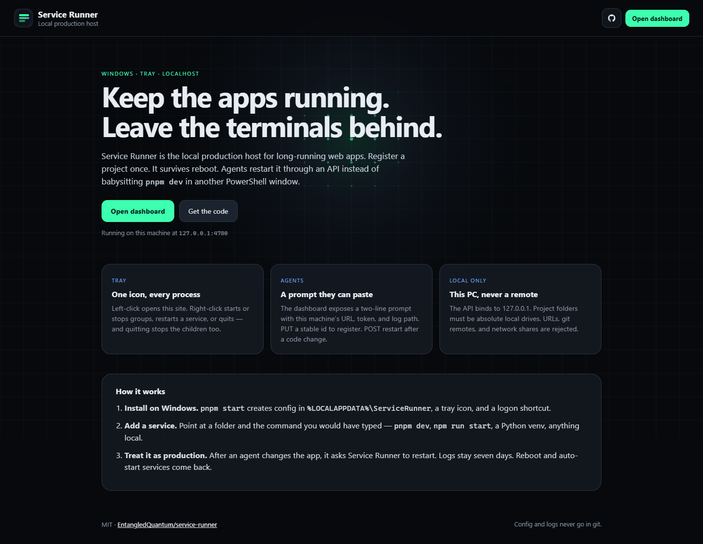

# Service Runner

Windows tray supervisor for local long-running web apps. Open source under the **[MIT License](LICENSE)**.

**Site → [entangledquantum.github.io/service-runner](https://entangledquantum.github.io/service-runner/)**  
Install, uninstall, how it works, and the live UI are all there. This repo is the source.



## Install (Windows)

```powershell
git clone https://github.com/EntangledQuantum/service-runner.git
cd service-runner
pnpm install
pnpm start
```

That command returns immediately. Close the terminal — Service Runner stays in the tray and comes back at logon. Site: [http://127.0.0.1:4780](http://127.0.0.1:4780). Config: `%LOCALAPPDATA%\ServiceRunner` (never committed).

`pnpm dev` is the only mode that stays attached (debug logs).

## Uninstall

1. Tray → **Quit Service Runner** (stops every child)
2. `pnpm run uninstall:startup` — removes the Windows logon shortcut
3. Optional: delete `%LOCALAPPDATA%\ServiceRunner` and the cloned folder

## License

[MIT](LICENSE) © 2026 EntangledQuantum
