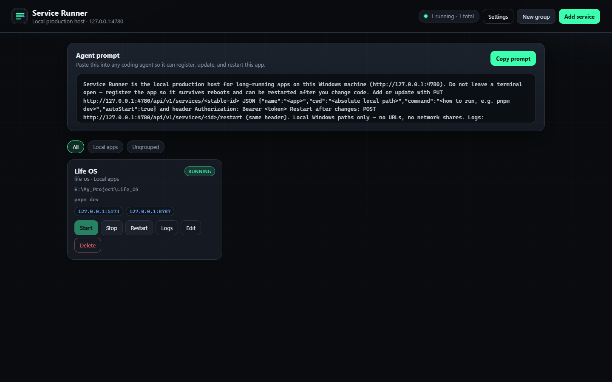
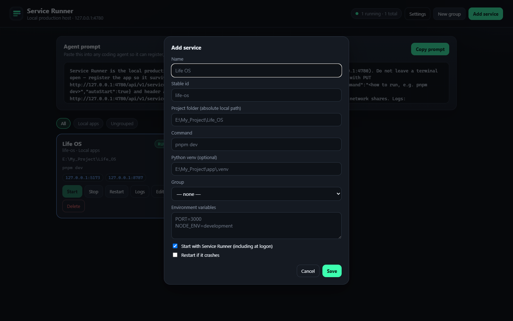
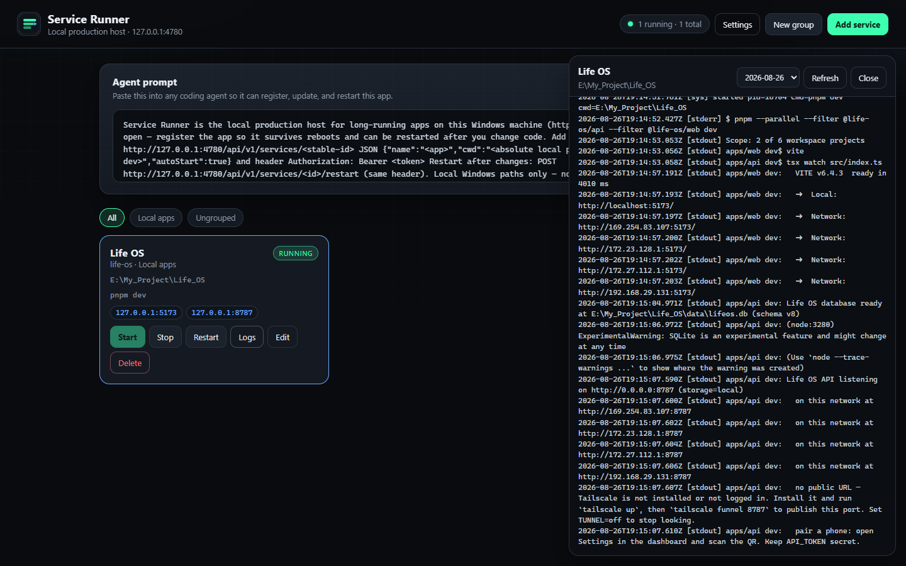

# Service Runner

Windows tray supervisor for the local web apps you (and your coding agents) keep running with `pnpm dev`, `npm run dev`, `python …`, and friends.

One process. One tray icon. One control panel. No extra PowerShell windows left open.

Service Runner is the **local production host** for long-running apps on this machine. Agents add a project once, you reboot, it comes back. After they change code, they restart it through the API instead of babysitting a terminal.



## What you get

- A **tray icon**. Left-click opens the control panel at `http://127.0.0.1:4780`. Right-click starts/stops groups and services, stops everything, or quits Service Runner (which stops every child too).
- A **dashboard** to add services, group them, watch logs, and copy an agent prompt.
- A **local HTTP API** so any agent can register an app with a stable id, update it, and restart it.
- **Logs** for the last 7 days (configurable), stored outside the git repo.
- **Start at Windows logon**, then auto-start every service that has that flag on.

It only runs programs that already live on this PC. URLs, git remotes, and network shares are rejected.

## Install (Windows)

```powershell
git clone https://github.com/EntangledQuantum/service-runner.git
cd service-runner
pnpm install          # or npm install
pnpm run make-icon
pnpm start            # tray + control panel + logon shortcut
```

Or run `scripts\install.ps1`.

The first launch:

1. Creates `%LOCALAPPDATA%\ServiceRunner\config.json` if it is missing
2. Puts a shortcut in your Startup folder so it returns after reboot
3. Shows a tray icon and opens the control panel

Runtime files (**not in git**, never commit them):

| What | Where |
| --- | --- |
| Config (services, groups, token, retention) | `%LOCALAPPDATA%\ServiceRunner\config.json` |
| Per-service logs | `%LOCALAPPDATA%\ServiceRunner\logs\<id>\YYYY-MM-DD.log` |
| Hidden launcher | `%LOCALAPPDATA%\ServiceRunner\launch.vbs` |

## Agent prompt

The control panel shows a two-to-three line prompt that already contains **this machine’s URL, token, and log path**. Copy it. Hand it to an agent working in a project folder.

Typical shape (values change with your port, token, and retention):

```
Service Runner is the local production host for long-running apps on this Windows machine (http://127.0.0.1:4780). …
Add or update with PUT http://127.0.0.1:4780/api/v1/services/<stable-id> JSON {"name":"…","cwd":"<absolute local path>","command":"pnpm dev","autoStart":true} and header Authorization: Bearer <token>. Restart after changes: POST …/restart.
Local Windows paths only. Logs: %LOCALAPPDATA%\ServiceRunner\logs\<id>\ (last 7 days).
```



## API

All API routes bind to **127.0.0.1 only**. Send `Authorization: Bearer <token>` (the token is in the prompt and in Settings).

| Method | Path | Purpose |
| --- | --- | --- |
| `PUT` | `/api/v1/services/:id` | Create or update. Unique id is yours to choose (`life-os`, `focusspace`, …). Updating a running service restarts it when cwd/command/env change. |
| `POST` | `/api/v1/services/:id/restart` | Restart this app after a code change |
| `POST` | `/api/v1/services/:id/start` | Start |
| `POST` | `/api/v1/services/:id/stop` | Stop |
| `GET` | `/api/v1/services` | List services + groups |
| `GET` | `/api/v1/services/:id/logs` | Tail logs (`?date=YYYY-MM-DD&tail=400`) |
| `POST` | `/api/v1/groups` | Create a group |
| `POST` | `/api/v1/groups/:id/start` | Start every service in the group |
| `POST` | `/api/v1/groups/:id/stop` | Stop the group |
| `GET` | `/api/v1/prompt` | The live agent prompt + example payload |
| `POST` | `/api/v1/stop-all` | Stop every service |
| `POST` | `/api/v1/shutdown` | Stop every service and exit Service Runner |

Example — register a local app (PowerShell):

```powershell
$token = "<paste from the control panel>"
Invoke-RestMethod -Method PUT `
  -Uri http://127.0.0.1:4780/api/v1/services/life-os `
  -Headers @{ Authorization = "Bearer $token" } `
  -ContentType "application/json" `
  -Body ({
    name = "Life OS"
    cwd = "E:\My_Project\Life_OS"
    command = "pnpm dev"
    autoStart = $true
  } | ConvertTo-Json)
```

`cwd` must be an absolute local directory (`E:\…`). `command` is whatever you would have typed in a terminal (`pnpm dev`, `npm run start`, `python -m uvicorn app:app`). Optional fields: `args`, `env`, `venv` (Python virtualenv path — its `Scripts` dir is prepended to `PATH`), `pathPrepend`, `groupId`, `restartOnCrash`.



## Tray

| Action | Result |
| --- | --- |
| Left-click | Open the control panel |
| Right-click → Groups | Start / stop a whole group |
| Right-click → a service | Start / stop / restart |
| Stop all services | Children die; Service Runner stays |
| Quit Service Runner | Stop everything and exit |

## Settings

- Log retention (default **7 days**)
- Start Service Runner at Windows logon
- Open the control panel on launch

## Development

```powershell
pnpm test          # local-path + id guards
pnpm dev           # watch mode
pnpm run screenshot
```

`pnpm run screenshot` talks to a running instance and writes `docs/screenshots/*.png` via Playwright (Edge).

## License

MIT
